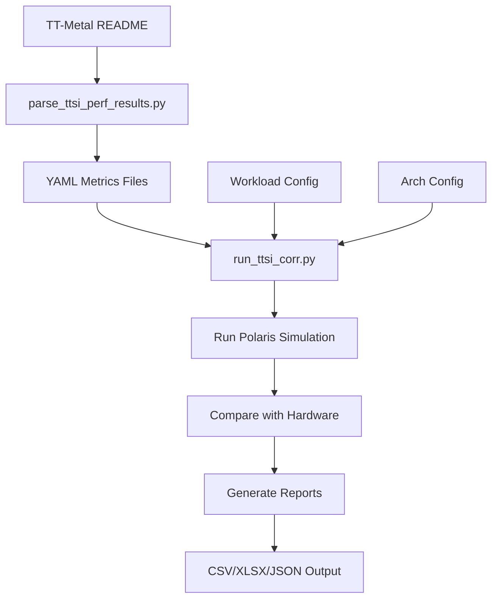

# Performance Correlation Tools

## Overview

The Polaris performance correlation tools enable validation and calibration of simulation accuracy by comparing Polaris simulation results with actual hardware measurements from TT-Metal.

## Architecture

The correlation tools have been refactored into a **modular architecture** with the `ttsi_corr` Python package:

**Package Structure** (`tools/ttsi_corr/`):
- **data_loader** - Load and validate reference metrics from HTML/Markdown sources
- **workload_processor** - Process and validate workload configurations
- **correlation** - Calculate correlation metrics and comparisons
- **excel_writer** - Generate Excel reports with formatted tables
- **chart_builder** - Create visualization charts (S-curve analysis)
- **simulator** - Orchestrate Polaris simulation execution

**Benefits**:
- ✅ **Reusable Components**: Each module can be used independently
- ✅ **Testable**: 25 unit tests + integration tests
- ✅ **Maintainable**: Single responsibility principle, clear interfaces
- ✅ **Well-Documented**: Comprehensive docstrings and examples
- ✅ **Type-Safe**: Full type annotations for IDE support

**Code Reduction**: The refactoring reduced `run_ttsi_corr.py` from 1407 lines to 573 lines (59.3% reduction) by extracting 1973 lines into reusable modules.

For complete package documentation, see [tools/ttsi_corr/README.md](../../tools/ttsi_corr/README.md).

## Reference Data Tag System

The correlation tools use a **tag system** to manage and version TT-Metal reference performance data.

**TL;DR:** Tags version TT-Metal reference data. Current default: `03nov25`. See `TTSI_REF_VALID_TAGS` in `tools/ttsi_corr/ttsi_corr_utils.py` for all valid tags. Use `--tag <TAG>` to specify a version, or omit to use the default.

### What are Tags?

Tags are version identifiers that label specific snapshots of TT-Metal hardware measurements:
- **Format**: Typically date-based (e.g., `03nov25` = November 3, 2025)
- **Storage**: Each tag has a directory at `data/metal/inf/<TAG>/`
- **Contents**: YAML files containing categorized performance metrics
- **Metadata**: Each tag includes a `_metadata.yaml` file tracking data source and parsing date

### Configuration

Tags are configured in `tools/ttsi_corr/ttsi_corr_utils.py`:

```python
# Valid tags for TTSI reference data. The first tag is the default, so the order of tags matters.
TTSI_REF_VALID_TAGS = ['03nov25', '15oct25']
TTSI_REF_DEFAULT_TAG = TTSI_REF_VALID_TAGS[0]  # Current default: '03nov25'
```

### Using Tags

**Default Behavior:**
- Scripts use `TTSI_REF_DEFAULT_TAG` automatically
- Current default points to the latest validated reference data

**Explicit Tag Selection:**
```bash
# Use a specific tag
python tools/run_ttsi_corr.py --tag 15oct25 ...

# Or use the default (no --tag needed in some cases)
python tools/run_ttsi_corr.py ...
```

**Programmatic Access:**
```python
from tools.ttsi_corr.ttsi_corr_utils import TTSI_REF_DEFAULT_TAG, TTSI_REF_VALID_TAGS

# Get current default
print(f"Default tag: {TTSI_REF_DEFAULT_TAG}")

# List all valid tags
print(f"Valid tags: {TTSI_REF_VALID_TAGS}")
```

### Creating Custom Tags

To create a new reference data tag:

1. **Parse metrics with new tag:**
   ```bash
   python tools/parse_ttsi_perf_results.py \
       --tag my_new_tag \
       --input <DATA_SOURCE> \
       --output-dir data/metal/inf
   ```

   This creates:
   - `data/metal/inf/my_new_tag/` directory
   - Metric YAML files (llm, vision, detection, nlp, diffusion)
   - `_metadata.yaml` with data source information

2. **Use the new tag for correlation:**
   ```bash
   python tools/run_ttsi_corr.py \
       --tag my_new_tag \
       --workloads-config config/ttsi_correlation_workloads.yaml
   ```

3. **Optional: Add to valid tags** (for team use):
   Edit `tools/ttsi_corr/ttsi_corr_utils.py`:
   ```python
   TTSI_REF_VALID_TAGS = ['my_new_tag', '03nov25', '15oct25']
   ```

### Tag Best Practices

**For Developers:**
- ✅ Update `TTSI_REF_DEFAULT_TAG` when new reference data is validated
- ✅ Use date-based naming convention (e.g., `DDmmmYY` format)
- ✅ Commit tag directories to version control for reproducibility

**For Users:**
- ✅ Always use the same tag for both parsing and correlation
- ✅ Check tag directory exists before running correlation
- ✅ Use explicit `--tag` for reproducible results

**Tag Naming Conventions:**
- Date-based: `03nov25`, `15oct25` (recommended for official releases)

### Troubleshooting

**Error: Tag directory not found**
```bash
# Check if tag directory exists
ls -la data/metal/inf/<TAG>/

# If missing, parse metrics first
python tools/parse_ttsi_perf_results.py --tag <TAG> --input <SOURCE>
```

**Error: Mismatched tags**
```bash
# Ensure parsing and correlation use the same tag
python tools/parse_ttsi_perf_results.py --tag mytag ...
python tools/run_ttsi_corr.py --tag mytag ...  # Must match!
```

**Error: Invalid tag**
```python
# Check valid tags
from tools.ttsi_corr.ttsi_corr_utils import TTSI_REF_VALID_TAGS
print(f"Valid tags: {TTSI_REF_VALID_TAGS}")
```

## Tools

### 1. run_ttsi_corr.py

Main correlation tool that orchestrates the entire correlation workflow.

**Location**: `tools/run_ttsi_corr.py`

**Purpose**: Automates the process of running Polaris simulations and comparing results with hardware measurements.

**Usage**:
```bash
python tools/run_ttsi_corr.py \
    --tag <TAG> \
    --workloads-config config/ttsi_correlation_workloads.yaml \
    --arch-config config/tt_wh.yaml \
    --output-dir __CORRELATION_OUTPUT
```

**Note**: Requires that metrics have been parsed first with `parse_ttsi_perf_results.py` to create the metadata file. `<TAG>` should match the tag used during parsing (see `TTSI_REF_VALID_TAGS` in `tools/ttsi_corr/ttsi_corr_utils.py`).

**Key Features**:
- Automated Polaris simulation execution
- Side-by-side comparison with hardware metrics
- Multiple output formats (CSV, XLSX, JSON)
- Geometric mean calculation for aggregate accuracy
- Flexible input sources (directory, URL, markdown files)

**Output Files**:
- `correlation_result.csv` - Tabular comparison data
- `correlation_result.xlsx` - Formatted Excel workbook with formulas
- `correlation_geomean.json` - Aggregate metrics
- `SIMPLE/` - Polaris simulation results
- `inputs/` - Saved configuration for reproducibility

### 2. parse_ttsi_perf_results.py

Markdown metrics parser for extracting performance data from TT-Metal documentation.

**Location**: `tools/parse_ttsi_perf_results.py`

**Purpose**: Extract and categorize performance metrics from markdown tables.

**Usage**:
```bash
python tools/parse_ttsi_perf_results.py \
    --tag 15oct25 \
    --input https://raw.githubusercontent.com/tenstorrent/tt-metal/main/models/README.md \
    --output-dir data/metal/inf
```

**Key Features**:
- Standards-compliant markdown parsing (CommonMark)
- Automatic categorization by model type
- Support for multiple metric types (LLM, vision, detection, NLP, diffusion)
- YAML output format
- Caching for performance

**Output Files** (saved to `{output-dir}/{tag}/`):
- `tensix_md_perf_metrics_llm.yaml`
- `tensix_md_perf_metrics_vision.yaml`
- `tensix_md_perf_metrics_detection.yaml`
- `tensix_md_perf_metrics_nlp.yaml`
- `tensix_md_perf_metrics_diffusion.yaml`
- `_metadata.yaml` - Metadata file containing data source, tag, URL, and parsing date

### 3. Markdown Parser Library

Standalone library for markdown table parsing.

**Location**: `tools/parsers/md_parser.py`

**Purpose**: Reusable library for parsing markdown performance tables.

**Key Components**:
- `TensixMdPerfMetricModel` - Pydantic model for metrics
- `extract_table_from_md_link()` - Main parsing function
- `save_md_metrics()` - Save metrics to YAML
- Column name mapping and normalization

**Documentation**:
- [Parser README](../../tools/parsers/README.rst) - Architecture and API
- [Usage Examples](../../tools/parsers/USAGE_EXAMPLE.rst) - Examples and patterns

### 4. Supporting Modules

**workloads.py** (`tools/workloads.py`):
- Pydantic models for workload configuration
- Validation and schema enforcement
- File loading utilities

**ttsi_corr_utils.py** (`tools/ttsi_corr/ttsi_corr_utils.py`):
- Utility functions for name normalization
- Hardware string parsing
- Workload name mapping

## Workflow

### Complete Correlation Workflow



### Step-by-Step Guide

1. **Extract Hardware Metrics**
   ```bash
   python tools/parse_ttsi_perf_results.py \
       --tag <TAG> \
       --input https://raw.githubusercontent.com/tenstorrent/tt-metal/main/models/README.md \
       --output-dir data/metal/inf
   ```
   
   This creates metric files and a `_metadata.yaml` file in `data/metal/inf/<TAG>/` containing:
   - Data source format (html or md)
   - Tag name
   - Source URL
   - Parsing timestamp

2. **Configure Workloads**
   Edit `config/ttsi_correlation_workloads.yaml` to define models for correlation:
   ```yaml
   workloads:
     - api: TTSIM
       name: resnet50
       module: BasicResNet@basicresnet.py
       instances:
         corr:
           bs: 32
   ```

3. **Run Correlation**
   ```bash
   python tools/run_ttsi_corr.py \
       --tag <TAG> \
       --workloads-config config/ttsi_correlation_workloads.yaml \
       --arch-config config/tt_wh.yaml \
       --output-dir __CORRELATION_OUTPUT
   ```
   
   The script automatically:
   - Reads metadata from `data/metal/inf/<TAG>/_metadata.yaml`
   - Determines data source format (html or md)
   - Loads appropriate metric files
   - Runs Polaris simulation
   - Compares results with hardware metrics

4. **Analyze Results**
   - Open `correlation_result.xlsx` for visual analysis
   - Check `correlation_geomean.json` for aggregate metrics
   - Review `correlation_result.csv` for data processing

## Command Line Options

### run_ttsi_corr.py

**Reference Data** (required):
- `--tag TAG` - Tag subdirectory name. Valid tags are defined in `tools/ttsi_corr/ttsi_corr_utils.py::TTSI_REF_VALID_TAGS`
- `--input-dir PATH` - Base directory containing tagged metrics (default: `data/metal/inf`)

**WL/Arch Configurations**:
- `--workloads-config PATH` - Workload configuration file (default: `config/ttsi_correlation_workloads.yaml`)
- `--arch-config PATH` - Architecture specification file (default: `config/tt_wh.yaml`)
- `--workload-filter NAMES` - Comma-separated workload names to process
- `--precision TYPE` - Override precision for all workloads (e.g., bf8, bf16, fp32)

**General Options**:
- `--output-dir PATH` - Output directory (default: `__CORR_TENSIX_HLM_OUT`)
- `--dry-run` - Show what would be done without executing

**Note**: Data source format (html/md) is automatically detected from the metadata file created by `parse_ttsi_perf_results.py`.

### parse_ttsi_perf_results.py

**Required**:
- `--tag, -t TAG` - Tag for output subdirectory. Valid tags are defined in `tools/ttsi_corr/ttsi_corr_utils.py::TTSI_REF_VALID_TAGS`

**Optional**:
- `--input, -i URL` - Input URL or file path (default: TT-Metal models README)
- `--output-dir, -o PATH` - Base output directory (default: `data/metal/inf`)
- `--use-cache, -c` / `--no-use-cache` - Cache control (default: use cache)

**Output**: Creates `{output-dir}/{tag}/` directory with metric YAML files and `_metadata.yaml`

## Output Format Specifications

### CSV Format

Columns:
- `archname` - Architecture package name (e.g., Grendel, Wormhole)
- `devname` - Device instance name (e.g., Q1_A1, n150)
- `wl` - Workload name
- `bs` - Batch size
- `system` - Hardware platform
- `reference_perf` - Hardware measured performance
- `reference_metric` - Metric name from hardware
- `actual_perf` - Polaris simulated performance
- `actual_metric` - Metric name from simulation
- `ratio` - actual/reference ratio
- `score_to_ref` - Ratio as percentage

**Note**: The `archname` field distinguishes architecture packages from device instances (`devname`), enabling easier filtering and analysis by architecture family.

### XLSX Format

Features:
- Formatted headers with bold text
- Number formatting for metrics
- Formula columns for ratios
- Conditional formatting for visual analysis
- Frozen panes for easier navigation
- Multiple sheets for different analyses

### JSON Format (Geometric Mean)

```json
{
  "geometric_mean": {
    "ratio_score_to_ref": 0.95,
    "count": 10,
    "workloads": ["resnet50", "bert", ...]
  }
}
```

### YAML Format (Metrics)

```yaml
- archname: Wormhole
  devname: n150
  batch: 32
  hardware: n150 (Wormhole)
  model: Llama 3.1 8B
  release: v0.55.0
  tokens_per_sec_per_user: 23.5
  target_tokens_per_sec_per_user: 26.0
  ttft_ms: 89.0
  gpu: Tensix
  id: metal
```

**Note**: The `archname` field represents the architecture package name (e.g., Wormhole, Grendel), while `devname` represents the specific device instance (e.g., n150, n300).

## Configuration Files

### Workload Configuration

**Format**: YAML with Pydantic validation

**Required Fields**:
- `api` - API type (e.g., TTSIM)
- `name` - Workload name
- `basedir` - Base directory
- `module` - Module specification
- `instances` - Instance configurations

**Example**:
```yaml
workloads:
  - api: TTSIM
    name: resnet50
    basedir: workloads
    module: BasicResNet@basicresnet.py
    instances:
      corr:
        bs: 32
        layers: 50
```

### Architecture Configuration

Standard Polaris architecture YAML file.

**Example**: `config/tt_wh.yaml`

## Troubleshooting

### Common Issues

**Issue: No metrics extracted from URL**
- **Cause**: URL inaccessible, wrong format, or no tables found
- **Solution**: 
  - Verify URL accessibility
  - Check markdown format (must have pipe-delimited tables)
  - Ensure tables have "model" column

**Issue: Workload not found in configuration**
- **Cause**: Workload name mismatch or missing instance
- **Solution**:
  - Check workload name matches between hardware data and config
  - Ensure `corr` instance exists in workload configuration
  - Verify module path is correct

**Issue: Large correlation discrepancies**
- **Cause**: Configuration mismatch, different parameters
- **Solution**:
  - Verify batch size matches
  - Check architecture configuration
  - Review data types and precision
  - Consider hardware-specific optimizations

### Debug Mode

Enable detailed logging:

```python
from loguru import logger
import sys

logger.remove()
logger.add(sys.stdout, level='DEBUG')
```

Or set log level via tool:

```bash
# Add logging configuration to script
export LOGURU_LEVEL=DEBUG
python tools/run_ttsi_corr.py ...
```

## API Reference

### Python API Usage

**Parse Markdown Metrics**:
```python
from tools.parsers.md_parser import extract_table_from_md_link, save_md_metrics
from pathlib import Path

# Extract metrics
url = 'https://...'
metrics = extract_table_from_md_link(url, use_cache=True)

# Save to files
output_dir = Path('data/metal/inf')
save_md_metrics(metrics, output_dir)
```

**Run Correlation Programmatically** (using main script):
```python
from tools.run_ttsi_corr import main
from tools.ttsi_corr.ttsi_corr_utils import TTSI_REF_DEFAULT_TAG

# Run correlation using default tag
result = main([
    'run_ttsi_corr',
    '--tag', TTSI_REF_DEFAULT_TAG,
    '--workloads-config', 'config/ttsi_correlation_workloads.yaml',
    '--arch-config', 'config/tt_wh.yaml',
    '--output-dir', 'output'
])
```

**Use Modular Components** (recommended for programmatic access):
```python
from pathlib import Path
from ttsi_corr import (
    load_metrics_from_sources,
    read_metadata,
    process_workload_configs,
    validate_and_filter_configs,
    compare_scores,
    calculate_and_save_geomean,
    write_csv,
    add_scurve_chart
)
from tools.ttsi_corr.ttsi_corr_utils import TTSI_REF_DEFAULT_TAG

# 1. Load data
data_dir = Path(f'data/metal/inf/{TTSI_REF_DEFAULT_TAG}')
metadata = read_metadata(data_dir)
metrics = load_metrics_from_sources(data_dir, metadata['data_source'])

# 2. Validate and filter
valid_configs = validate_and_filter_configs(metrics, workload_filter=None)

# 3. Process workloads
ttsim_wlspec, ref_scores, devices = process_workload_configs(
    valid_configs, workloads_file, None, 'fp16', device_table, 'corr'
)

# 4. Compare scores
comparison = compare_scores(ref_scores, actual_scores)

# 5. Generate reports
calculate_and_save_geomean(comparison, output_dir / 'geomean.json')
write_csv(comparison, output_dir / 'correlation_result.csv')
```

**Load Workload Configuration**:
```python
from tools.workloads import load_workloads_file

# Load and validate
workloads_file = load_workloads_file('config/ttsi_correlation_workloads.yaml')
for workload in workloads_file.workloads:
    print(f"Workload: {workload.name}")
    print(f"Module: {workload.module}")
```

## Best Practices

1. **Version Control Metrics Data**
   - Commit YAML metric files to track hardware performance over time
   - Tag releases to match TT-Metal versions

2. **Automate Correlation**
   - Set up CI/CD to run correlation on PRs
   - Track geometric mean trends over time
   - Alert on significant accuracy degradation

3. **Document Discrepancies**
   - Investigate and document large ratio deviations
   - Update workload configurations as needed
   - Consider known hardware optimizations

4. **Use Caching Appropriately**
   - Enable cache for repeated development testing
   - Disable cache for production/CI runs
   - Clear cache when TT-Metal updates

5. **Validate Configurations**
   - Ensure workload parameters match hardware measurements
   - Verify architecture configurations
   - Check data types and precision settings

## Dependencies

**Core Dependencies**:
- `markdown-it-py>=3.0.0` - Markdown parsing
- `pydantic>=2.0` - Data validation
- `openpyxl>=3.1` - Excel file generation
- `loguru` - Logging
- `yaml` - Configuration parsing

**Polaris Dependencies**:
- All standard Polaris requirements
- See `environment.yaml` and `envdev.yaml`

## Further Documentation

- [Parser README](../../tools/parsers/README.rst) - Detailed parser documentation
- [Usage Examples](../../tools/parsers/USAGE_EXAMPLE.rst) - Code examples and patterns
- [Migration History](../../tools/parsers/PARSER_COMPARISON.rst) - Parser evolution
- [User Guide](../user_guide.md) - Complete workflow documentation
- [Main README](../../README.md) - Project overview

## Support

For issues and questions:
- Check existing GitHub issues
- Review tool-specific documentation
- Consult development team for advanced support
